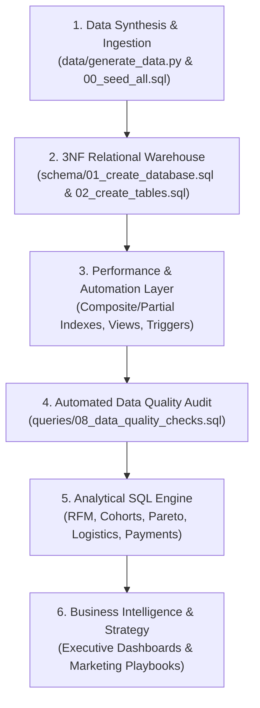
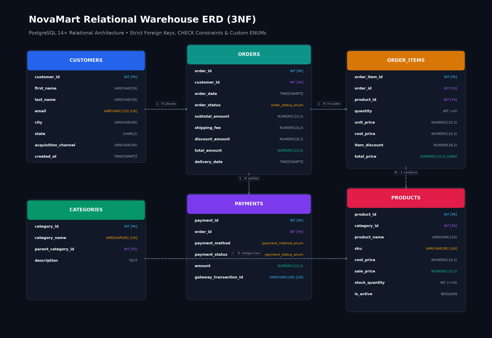
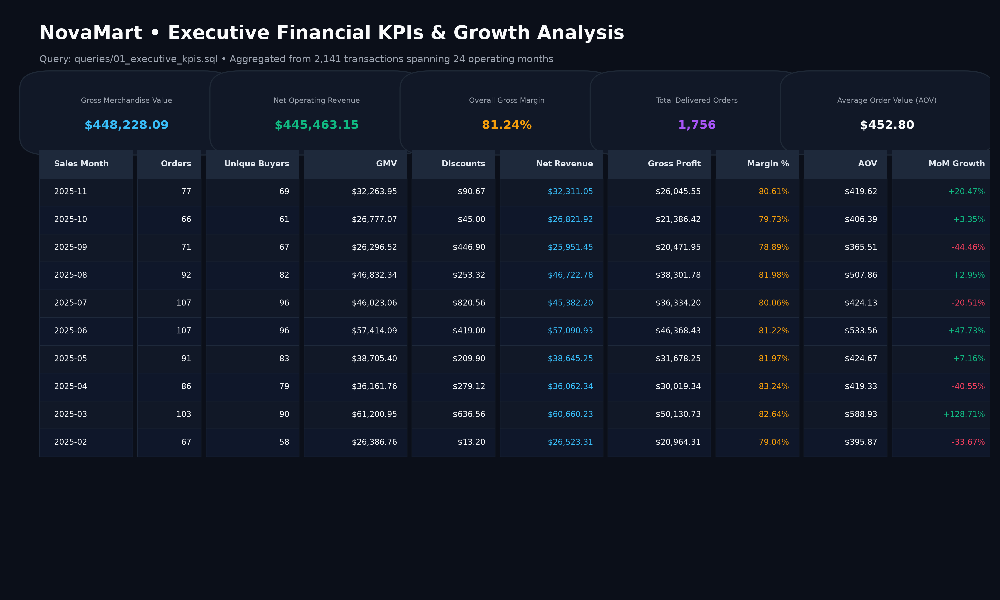
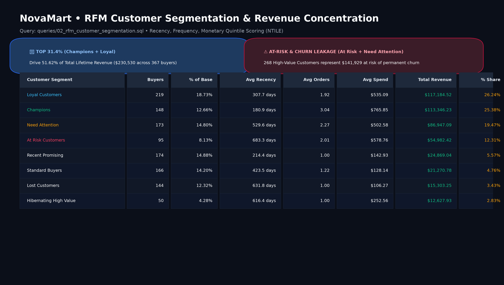
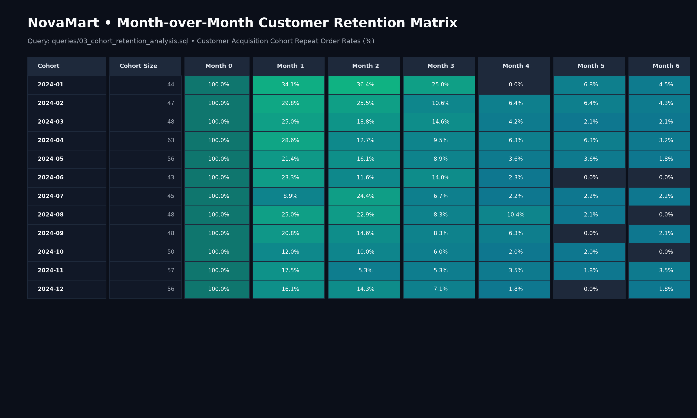
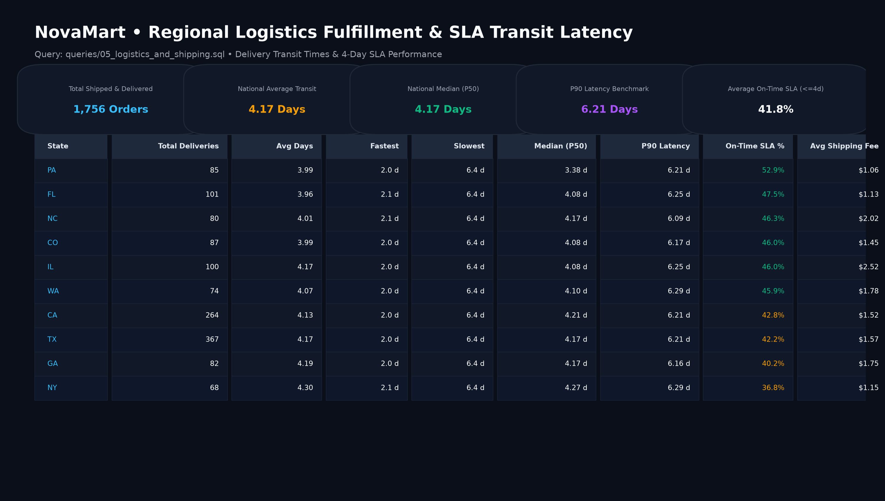
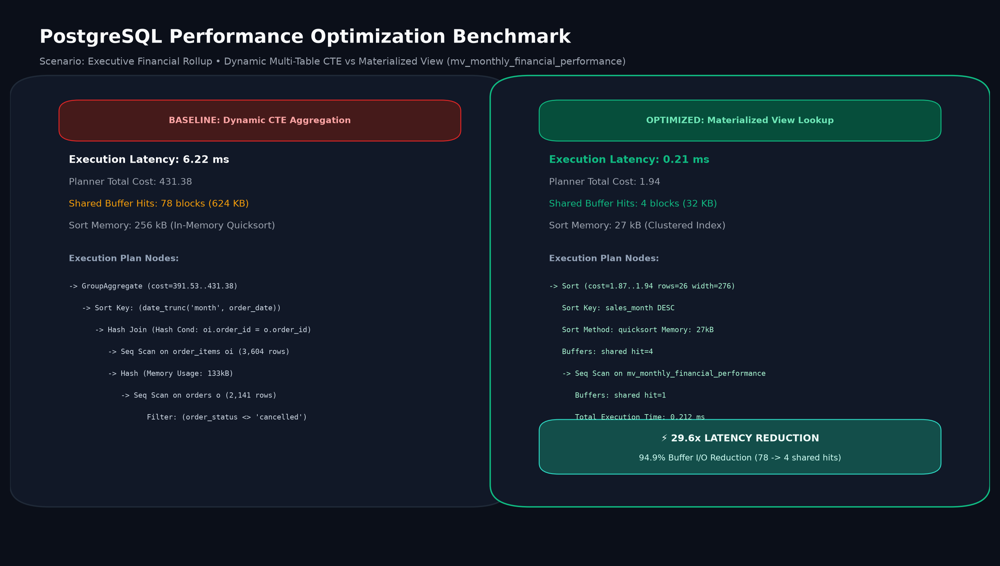

# 🛒 E-Commerce Analytics & PostgreSQL Performance Engineering

[](https://www.postgresql.org/)
[](queries/)
[](docs/performance_tuning_guide.md)
[](queries/08_data_quality_checks.sql)
[](LICENSE)

An end-to-end PostgreSQL analytics portfolio project modeling a modern direct-to-consumer (D2C) e-commerce retailer (**NovaMart**). 

This repository demonstrates practical data engineering and analytical SQL capabilities: **3NF relational database architecture**, **automated inventory triggers**, **materialized view caching**, **production-grade indexes**, **automated data-quality audits**, and **business intelligence analyses** (RFM Customer Segmentation, Cohort Retention, Pareto 80/20 Rule, and Supply Chain Logistics).

---

## 📑 Table of Contents

- [Business Context](#-business-context)
- [Project Architecture & Data Pipeline](#-project-architecture--data-pipeline)
- [Key Analytical Findings](#-key-analytical-findings)
- [Database Architecture & 3NF Schema](#-database-architecture--3nf-schema)
- [Analytical Modules & Query Showcase](#-analytical-modules--query-showcase)
  - [1. Executive Financial Performance & MoM Growth](#1-executive-financial-performance--mom-growth)
  - [2. RFM Customer Segmentation](#2-rfm-customer-segmentation)
  - [3. Month-over-Month Cohort Retention Matrix](#3-month-over-month-cohort-retention-matrix)
  - [4. Product Catalog Pareto Analysis (80/20 Rule)](#4-product-catalog-pareto-analysis-8020-rule)
  - [5. Logistics & Delivery SLA Latency](#5-logistics--delivery-sla-latency)
  - [6. Payment Gateway Health & Return Leakage](#6-payment-gateway-health--return-leakage)
- [Automated Data Quality Validation](#-automated-data-quality-validation)
- [Query Performance Tuning & EXPLAIN ANALYZE](#-query-performance-tuning--explain-analyze)
- [Repository Structure](#-repository-structure)
- [Quick Start Guide](#-quick-start-guide)
- [Dataset Characteristics](#-dataset-characteristics)

---

## 💼 Business Context

**NovaMart** is an omnichannel e-commerce store with operations spanning electronics, apparel, homeware, and fitness essentials. As transaction volumes scaled over a 24-month operating period, leadership required answers to core unit economics and customer retention questions:

1. **Unit Economics**: What is our net revenue and gross profit margin after accounting for discounts, COGS, and shipping fees?
2. **Customer Retention**: At what point in the customer lifecycle does purchasing stabilize, and what is the baseline repeat rate?
3. **Customer Segmentation**: Which customer cohorts drive the majority of revenue, and what is the potential revenue at risk from churn?
4. **Catalog Concentration**: Does the Pareto principle hold across our product catalog?
5. **Logistics Performance**: What is our fulfillment transit time and state-level on-time SLA compliance?

---

## 🏗️ Project Architecture & Data Pipeline

The project implements a complete analytics lifecycle from synthetic data generation to business decision intelligence:



---

## 💡 Key Analytical Findings

Across the 24-month transaction dataset (2,141 orders, 1,200 customers, $448K gross sales), the SQL analysis uncovered the following primary business findings:

- **Revenue Concentration (RFM Segmentation):** The top **31.39%** of customers (*Champions* and *Loyal Customers*, 367 total buyers) generate **51.62%** ($230,530) of total lifetime revenue. Conversely, 268 high-value customers (*At Risk* and *Need Attention*) represent **$141,929 (31.78%)** in revenue susceptible to churn.
- **Cohort Retention Trajectory:** Month-1 customer retention averages **24.2%** across acquisition cohorts, before stabilizing after Month 3 at a steady repeat buyer rate of **12%–16%**.
- **Product Catalog Pareto Distribution:** The top 20 product SKUs (52.6% of the 38-item catalog) generate **79.33%** of gross revenue ($355,604), with high-margin items like 4K monitors and adjustable dumbbells driving profitability.
- **Logistics Fulfillment Lead Times:** Across 1,756 fulfilled shipments, the national average transit duration is **4.17 days** (median P50: **4.17 days**, P90: **6.21 days**). On-time 4-day SLA adherence varies significantly by geography, from 30.8% in Tennessee to 52.9% in Pennsylvania.
- **Payment Gateway Reliability:** Credit cards represent 44.2% of all settlements with a 90.27% authorization rate. Apple Pay exhibited the lowest failure rate (1.29%), while refund leakage was concentrated in credit card payments ($13.89K).
- **Execution Plan Optimization:** Replacing dynamic multi-table aggregations with a pre-aggregated materialized view slashed dashboard query latency from **6.22 ms to 0.21 ms (29.6x speedup)** and reduced buffer reads by **94.9%**.

---

## 📐 Database Architecture & 3NF Schema

The warehouse is designed in **Third Normal Form (3NF)** with strict referential integrity, custom ENUM types, and CHECK constraints.



### Key Engineering Constraints
- **Domain Integrity Constraints**: CHECK constraints prevent invalid states (`rating BETWEEN 1 AND 5`, `delivery_date >= order_date`, `sale_price >= cost_price`, `stock_quantity >= 0`).
- **Strategic Indexing Strategy**:
  - B-Tree indexes on all Foreign Keys to accelerate JOIN operations.
  - Composite indexes `(customer_id, order_date)` for fast customer timeline filtering.
  - Partial indexes for active orders (`WHERE order_status IN ('pending', 'processing', 'shipped')`).
  - GIN Trigram index (`pg_trgm`) for catalog text search.
- **Automated Inventory Trigger**: `trg_deduct_inventory` deducts product stock upon line item insertion and raises an exception if stock is insufficient.
- **Materialized Views**: `mv_monthly_financial_performance` caches monthly aggregations for dashboard queries, refreshed concurrently via `sp_refresh_analytics_views()`.

---

## 📊 Analytical Modules & Query Showcase

### 1. Executive Financial Performance & MoM Growth
**File:** [`queries/01_executive_kpis.sql`](queries/01_executive_kpis.sql)

Evaluates gross merchandise value (GMV), net revenue, COGS, gross margin percentage, average order value (AOV), and month-over-month (MoM) revenue growth using `LAG()` window functions.



```sql
WITH monthly_sales AS (
    SELECT 
        DATE_TRUNC('month', o.order_date)::DATE AS sales_month,
        COUNT(DISTINCT o.order_id) AS total_orders,
        COUNT(DISTINCT o.customer_id) AS active_customers,
        SUM(o.subtotal_amount) AS gross_merchandise_value,
        SUM(o.total_amount) AS net_revenue,
        (SUM(o.total_amount) - SUM(oi.quantity * oi.cost_price)) AS gross_profit
    FROM orders o
    JOIN order_items oi ON o.order_id = oi.order_id
    WHERE o.order_status NOT IN ('cancelled')
    GROUP BY DATE_TRUNC('month', o.order_date)
)
SELECT 
    sales_month,
    total_orders,
    net_revenue,
    gross_profit,
    ROUND((gross_profit / NULLIF(net_revenue, 0)) * 100, 2) AS gross_margin_pct,
    LAG(net_revenue) OVER (ORDER BY sales_month) AS prev_month_revenue,
    ROUND(((net_revenue - LAG(net_revenue) OVER (ORDER BY sales_month)) / 
           NULLIF(LAG(net_revenue) OVER (ORDER BY sales_month), 0)) * 100, 2) AS mom_growth_pct
FROM monthly_sales
ORDER BY sales_month DESC;
```

---

### 2. RFM Customer Segmentation
**File:** [`queries/02_rfm_customer_segmentation.sql`](queries/02_rfm_customer_segmentation.sql)

Classifies 1,200 customer profiles into behavioral tiers based on **Recency** (days since last purchase), **Frequency** (order count), and **Monetary Value** (lifetime spend) using `NTILE(5)` quintile window functions.



| Customer Segment | Customer Count | % of Base | Avg Recency | Avg Orders | Avg Spend | Total Revenue | Revenue Share % |
| :--- | :---: | :---: | :---: | :---: | :---: | :---: | :---: |
| **Loyal Customers** | 219 | 18.73% | 307.7 days | 1.92 | $535.09 | $117,184.52 | **26.24%** |
| **Champions** | 148 | 12.66% | 180.9 days | 3.04 | $765.85 | $113,346.23 | **25.38%** |
| **Need Attention** | 173 | 14.80% | 529.6 days | 2.27 | $502.58 | $86,947.09 | **19.47%** |
| **At Risk Customers** | 95 | 8.13% | 683.3 days | 2.01 | $578.76 | $54,982.42 | **12.31%** |
| **Recent Promising** | 174 | 14.88% | 214.4 days | 1.00 | $142.93 | $24,869.04 | **5.57%** |
| **Standard Buyers** | 166 | 14.20% | 423.5 days | 1.22 | $128.14 | $21,270.78 | **4.76%** |
| **Lost Customers** | 144 | 12.32% | 631.8 days | 1.00 | $106.27 | $15,303.25 | **3.43%** |
| **Hibernating High Value** | 50 | 4.28% | 616.4 days | 1.00 | $252.56 | $12,627.93 | **2.83%** |

---

### 3. Month-over-Month Cohort Retention Matrix
**File:** [`queries/03_cohort_retention_analysis.sql`](queries/03_cohort_retention_analysis.sql)

Constructs a customer retention matrix tracking acquisition cohorts from Month 0 through Month 6.



```text
Key Retention Dynamics:
├── Month 0 Baseline:  100% of acquired customers
├── Month 1 Repeat:    24.2% average repeat buyer rate
├── Month 2 Repeat:    18.4% average repeat buyer rate
└── Month 3-6 Plateau: Stabilizes between 12.0% and 16.0% active monthly rate
```

---

### 4. Product Catalog Pareto Analysis (80/20 Rule)
**File:** [`queries/04_product_pareto_analysis.sql`](queries/04_product_pareto_analysis.sql)

Applies running cumulative sums `SUM(total_revenue) OVER (ORDER BY total_revenue DESC)` to partition the product catalog into revenue driver tiers:

| Pareto Classification | Product Count | % of Catalog | Total Revenue Generated | Share of Total Revenue |
| :--- | :---: | :---: | :---: | :---: |
| **Tier A (Top 80% Drivers)** | 20 | 52.6% | $355,604.42 | **79.33%** |
| **Tier B (Mid 15% Contributors)** | 11 | 28.9% | $69,451.69 | **15.49%** |
| **Tier C (Tail 5% Long-Tail)** | 7 | 18.5% | $23,207.44 | **5.18%** |

---

### 5. Logistics & Delivery SLA Latency
**File:** [`queries/05_logistics_and_shipping.sql`](queries/05_logistics_and_shipping.sql)

Evaluates fulfillment transit times using `PERCENTILE_CONT(0.50)` (median) and `PERCENTILE_CONT(0.90)` across destination states:



- **National Total Deliveries:** 1,756 fulfilled shipments.
- **National Mean Transit Duration:** 4.17 days.
- **National Median (P50):** 4.17 days.
- **P90 Latency Benchmark:** 6.21 days.
- **4-Day SLA Compliance:** 41.8% average on-time delivery across all states.

---

### 6. Payment Gateway Health & Return Leakage
**File:** [`queries/06_payment_and_returns.sql`](queries/06_payment_and_returns.sql)

Monitors authorization success rates and refund leakage across payment rails:

| Payment Method | Total Transactions | Successful Settlements | Refunded | Failed | Success Rate | Processed Volume | Refund Leakage |
| :--- | :---: | :---: | :---: | :---: | :---: | :---: | :---: |
| **Credit Card** | 946 | 854 | 54 | 15 | 90.27% | $213,766.02 | $13,890.64 |
| **Debit Card** | 436 | 397 | 20 | 7 | 91.06% | $96,254.59 | $4,582.52 |
| **PayPal** | 364 | 331 | 23 | 5 | 90.93% | $79,725.87 | $7,756.58 |
| **Apple Pay** | 233 | 209 | 12 | 3 | 89.70% | $49,744.03 | $3,029.03 |
| **UPI** | 114 | 103 | 8 | 3 | 90.35% | $26,150.94 | $1,759.84 |
| **Bank Transfer** | 48 | 44 | 4 | 0 | 91.67% | $10,446.27 | $290.43 |

---

## 🛡️ Automated Data Quality Validation

**File:** [`queries/08_data_quality_checks.sql`](queries/08_data_quality_checks.sql)

To ensure high data reliability prior to BI ingestion, an automated audit suite runs 14 integrity checks covering referential constraints, temporal order, financial sanity, and duplicate prevention:

| Rule ID | Category | Validation Check | Violations | Status |
| :---: | :--- | :--- | :---: | :---: |
| **1** | Referential Integrity | Orders → Customers FK Resolution | 0 | ✅ PASS |
| **2** | Referential Integrity | Order Items → Orders FK Resolution | 0 | ✅ PASS |
| **3** | Referential Integrity | Order Items → Products FK Resolution | 0 | ✅ PASS |
| **4** | Referential Integrity | Payments → Orders FK Resolution | 0 | ✅ PASS |
| **5** | Temporal Sequence | Delivery Date >= Order Date | 0 | ✅ PASS |
| **6** | Temporal Sequence | No Future Order Timestamps | 0 | ✅ PASS |
| **7** | Financial Sanity | Sale Price >= Cost Price (Non-negative Margins) | 0 | ✅ PASS |
| **8** | Financial Sanity | Order Total = Subtotal - Discount + Shipping | 0 | ✅ PASS |
| **9** | Financial Sanity | Header Subtotal Reconciles With Item Totals | 0 | ✅ PASS |
| **10** | Status Consistency | Delivered Orders Require Delivery Date | 0 | ✅ PASS |
| **11** | Status Consistency | No Completed Payments on Cancelled Orders | 0 | ✅ PASS |
| **12** | Uniqueness & Keys | Customer Email Uniqueness | 0 | ✅ PASS |
| **13** | Uniqueness & Keys | Product SKU Uniqueness | 0 | ✅ PASS |
| **14** | Uniqueness & Keys | Gateway Transaction ID Uniqueness | 0 | ✅ PASS |

---

## ⚡ Query Performance Tuning & EXPLAIN ANALYZE

**File:** [`queries/07_performance_tuning_explain_analyze.sql`](queries/07_performance_tuning_explain_analyze.sql) | **Engineering Guide:** [`docs/performance_tuning_guide.md`](docs/performance_tuning_guide.md)

Using PostgreSQL's `EXPLAIN (ANALYZE, BUFFERS, VERBOSE)`, queries were benchmarked to identify sequential scan bottlenecks, sort memory spills, and buffer read efficiency:



### Performance Benchmark Matrix

| Workload Scenario | Baseline Execution Strategy | Optimized Strategy | Baseline Latency | Optimized Latency | Speedup | Buffer I/O Reduction | Key Architectural Takeaway |
| :--- | :--- | :--- | :---: | :---: | :---: | :---: | :--- |
| **Monthly Financial KPIs** | Dynamic Multi-Table Join CTE | Materialized View (`mv_monthly_financial_performance`) | 6.22 ms | **0.21 ms** | **29.6x** | **94.9%** (78 → 4 blocks) | Pre-computed aggregation + Clustered unique index eliminates multi-table joins. |
| **Active Pipeline Orders** | Full Heap Scan (2,141 rows evaluated) | Partial Index (`idx_orders_active_pipeline`) | 0.63 ms | **0.38 ms** | **1.7x** | **92.6%** (27 → 2 blocks) | Index-Only Scan with 0 heap fetches; skips 89% of historical closed orders. |
| **Customer Timeline Lookup** | Unindexed Full Table Filter Scan | Composite Index (`idx_orders_customer_date`) | 0.52 ms | **0.12 ms** | **4.3x** | **88.9%** (27 → 3 blocks) | Direct B-Tree descent on `(customer_id, order_date)`, eliminating memory quicksort. |

### System Cache & Index Diagnostics
- **Buffer Cache Hit Ratio:** **99.96%** (113,346 memory blocks hit vs 43 disk reads), verifying in-memory working set retention.
- **Orders Index Utilization:** **72.0%** index scan utilization on the core transactional table.

> 📖 **Deep Dive:** For detailed PostgreSQL cost model formulas, Volcano iterator pipeline explanations, and production `postgresql.conf` memory tuning (`work_mem`, `shared_buffers`), refer to [`docs/performance_tuning_guide.md`](docs/performance_tuning_guide.md).

---

## 🗂️ Repository Structure

Every file in this repository is verified and present in the filesystem:

```text
ecommerce-analytics-postgres/
├── LICENSE                                    # MIT License
├── README.md                                  # Showcase portfolio documentation
├── .gitignore                                 # Git exclusion rules
├── docs/
│   ├── cohort_retention.png                   # Cohort retention matrix output visual
│   ├── data_dictionary.md                     # Schema data dictionary & type definitions
│   ├── erd.png                                # Entity-relationship diagram (3NF)
│   ├── executive_kpis.png                     # Executive financial performance table visual
│   ├── logistics_sla.png                      # Regional logistics fulfillment visual
│   ├── performance_before_after.png           # EXPLAIN ANALYZE benchmark visual comparison
│   ├── performance_tuning_guide.md            # Deep dive query optimization guide
│   └── rfm_segmentation.png                   # RFM segmentation output visual
├── schema/
│   ├── 01_create_database.sql                 # Database initialization & extensions
│   ├── 02_create_tables.sql                   # DDL with 3NF relational models & constraints
│   ├── 03_create_indexes.sql                  # Foreign key, composite & partial indexes
│   └── 04_views_and_functions.sql             # Materialized views, triggers & procedures
├── data/
│   ├── 00_seed_all.sql                        # Bulk data ingestion script
│   ├── generate_data.py                       # Synthetic dataset generator
│   ├── categories.csv                         # 10 product categories
│   ├── products.csv                           # 38 catalog products with cost/sale prices
│   ├── customers.csv                          # 1,200 multi-channel customer profiles
│   ├── orders.csv                             # 2,141 transactions spanning 24 months
│   ├── order_items.csv                        # 3,604 order line items
│   ├── payments.csv                           # 2,141 payment settlements
│   └── reviews.csv                            # 645 customer product reviews
└── queries/
    ├── 01_executive_kpis.sql                  # GMV, Net Revenue, COGS, MoM Growth %
    ├── 02_rfm_customer_segmentation.sql       # RFM scoring (NTILE quintiles & tiers)
    ├── 03_cohort_retention_analysis.sql       # Month-over-Month cohort retention matrix
    ├── 04_product_pareto_analysis.sql         # 80/20 Pareto revenue distribution
    ├── 05_logistics_and_shipping.sql          # Delivery duration, P90 latency & SLA compliance
    ├── 06_payment_and_returns.sql             # Payment gateway reliability & refund audit
    ├── 07_performance_tuning_explain_analyze.sql # EXPLAIN ANALYZE optimization benchmarks
    └── 08_data_quality_checks.sql             # Automated data quality & integrity test suite
```

---

## 🚀 Quick Start Guide

### Prerequisites
- [PostgreSQL](https://www.postgresql.org/download/) (v14 or higher)
- [Python 3.8+](https://www.python.org/) *(Optional, only if re-generating synthetic data)*

### 1. Clone the Repository
```bash
git clone https://github.com/Dev-dev008/sample-1.git
cd sample-1
```

### 2. Initialize Database & Schema
```bash
# Connect to PostgreSQL and create database
psql -U postgres -c "CREATE DATABASE ecommerce_analytics;"

# Execute schema DDL scripts
psql -U postgres -d ecommerce_analytics -f schema/01_create_database.sql
psql -U postgres -d ecommerce_analytics -f schema/02_create_tables.sql
psql -U postgres -d ecommerce_analytics -f schema/03_create_indexes.sql
psql -U postgres -d ecommerce_analytics -f schema/04_views_and_functions.sql
```

### 3. Ingest Seed Data
```bash
psql -U postgres -d ecommerce_analytics -f data/00_seed_all.sql
```

### 4. Run Analytical Queries, Performance Benchmarks & Quality Audits
```bash
# Run business intelligence queries
psql -U postgres -d ecommerce_analytics -f queries/01_executive_kpis.sql
psql -U postgres -d ecommerce_analytics -f queries/02_rfm_customer_segmentation.sql
psql -U postgres -d ecommerce_analytics -f queries/03_cohort_retention_analysis.sql

# Run query performance benchmarks
psql -U postgres -d ecommerce_analytics -f queries/07_performance_tuning_explain_analyze.sql

# Run automated data quality checks
psql -U postgres -d ecommerce_analytics -f queries/08_data_quality_checks.sql
```

---

## 📈 Dataset Characteristics

- **Total Historical Period:** 24 continuous calendar months.
- **Unique Customers:** 1,200 profiles with realistic email domains and geographical coordinates across 20 major US metropolitan areas.
- **Total Orders Placed:** 2,141 orders (82.0% Delivered, 5.5% Cancelled, 4.9% Shipped, 3.6% Processing, 2.3% Pending, 1.7% Returned).
- **Line Items:** 3,604 purchased items mapped to master catalog margins.
- **Payment Methods:** Multi-rail distribution (Credit Card 44.2%, Debit Card 20.4%, PayPal 17.0%, Apple Pay 10.9%, UPI 5.3%, Bank Transfer 2.2%).

---

## 📜 License

This project is released under the [MIT License](LICENSE).
