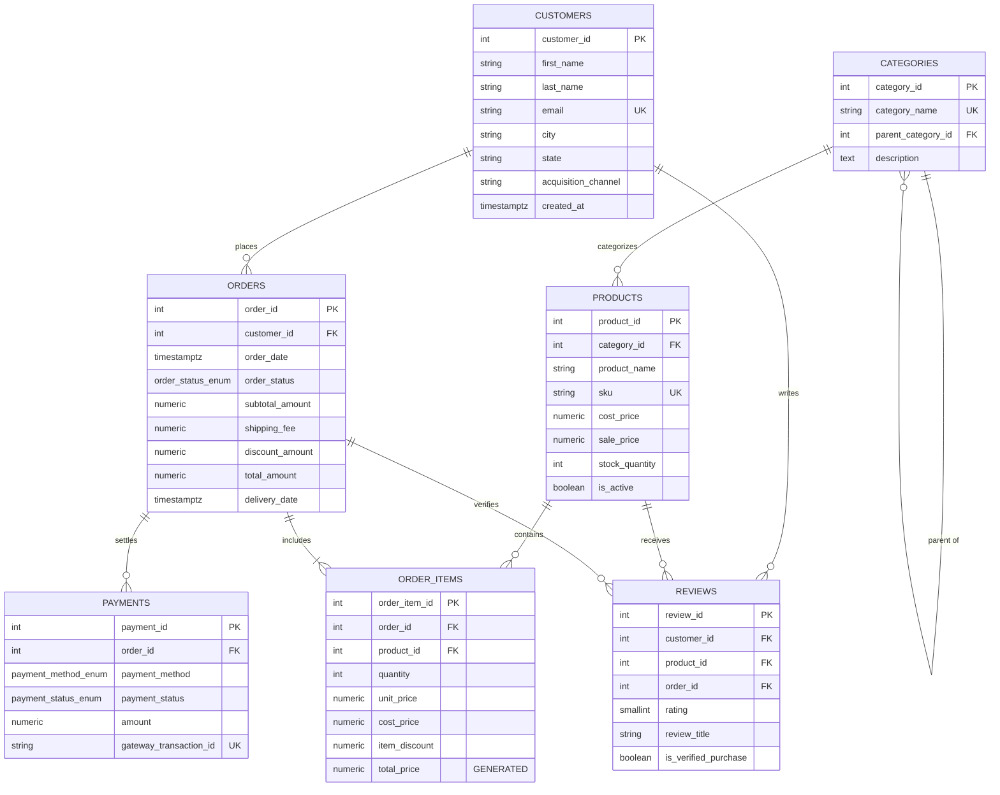

# 🛒 E-Commerce Analytics Database (PostgreSQL Portfolio Project)

[](https://www.postgresql.org/)
[](https://github.com/)
[](docs/performance_tuning_guide.md)
[](LICENSE)
[]()

An enterprise-grade PostgreSQL analytics database modeling a modern direct-to-consumer (D2C) e-commerce retailer (**NovaMart**). 

This repository serves as an end-to-end data engineering and analytics portfolio demonstration featuring **3NF relational database architecture**, **automated triggers**, **materialized views**, **production-grade indexes**, and **business intelligence SQL analyses** (RFM Customer Segmentation, Cohort Retention, Pareto 80/20 Rule, and Supply Chain Logistics).

---

## 📑 Table of Contents

- [Business Context](#-business-context)
- [Database Architecture & ERD](#-database-architecture--erd)
- [Key Features & Engineering Highlights](#-key-features--engineering-highlights)
- [Analytical Modules & Showcase Insights](#-analytical-modules--showcase-insights)
  - [1. Executive Financial Performance & MoM Growth](#1-executive-financial-performance--mom-growth)
  - [2. RFM Customer Segmentation](#2-rfm-customer-segmentation)
  - [3. Month-over-Month Cohort Retention Matrix](#3-month-over-month-cohort-retention-matrix)
  - [4. Product Catalog Pareto Analysis (80/20 Rule)](#4-product-catalog-pareto-analysis-8020-rule)
  - [5. Logistics & SLA Transit Analysis](#5-logistics--sla-transit-analysis)
  - [6. Payment Gateway Health & Return Leakage](#6-payment-gateway-health--return-leakage)
  - [7. Query Performance & EXPLAIN ANALYZE Optimization](#7-query-performance--explain-analyze-optimization)
- [Repository Structure](#-repository-structure)
- [Quick Start Guide](#-quick-start-guide)
- [Dataset Characteristics](#-dataset-characteristics)

---

## 💼 Business Context

**NovaMart** is an omnichannel e-commerce store with operations spanning electronics, apparel, homeware, and lifestyle essentials. As transaction volumes scaled over a 24-month operating period, leadership faced critical business questions:

1. **Unit Economics**: What is our true gross margin after factoring promo discounts, COGS, and shipping revenue?
2. **Customer Lifetime Value & Churn**: Which customer cohorts sustain repeat purchasing, and where is the churn drop-off point?
3. **Segmentation Strategy**: Who are our high-value "Champions" vs "At-Risk" buyers for targeted email marketing?
4. **Inventory Concentration**: Does the Pareto principle hold (do 20% of product SKUs drive 80% of revenue)?
5. **Logistics Bottlenecks**: Are delivery SLAs being met across all shipping territories?

---

## 📐 Database Architecture & ERD

The database follows **Third Normal Form (3NF)** standards with strict referential integrity, domain constraints, custom ENUMs, and auto-computed total columns.



---

## ⚙️ Key Features & Engineering Highlights

- **Domain Integrity Constraints**: CHECK constraints prevent invalid data (e.g. `rating BETWEEN 1 AND 5`, `delivery_date >= order_date`, `sale_price >= cost_price`, `stock_quantity >= 0`).
- **Strategic Indexing Strategy**:
  - B-Tree indexes on all Foreign Keys to accelerate JOIN operations.
  - Composite indexes `(customer_id, order_date)` for fast cohort filtering.
  - Partial indexes for active orders (`WHERE order_status IN ('pending', 'processing', 'shipped')`) and low stock alerts.
  - GIN Trigram index (`pg_trgm`) for fuzzy catalog text search.
- **Automated Inventory Trigger**: `trg_deduct_inventory` automatically adjusts product stock upon order item creation and aborts if inventory is insufficient.
- **Materialized Views**: `mv_monthly_financial_performance` caches heavy aggregation calculations for sub-millisecond dashboard queries, refreshed via a stored procedure (`sp_refresh_analytics_views()`).

---

## 📊 Analytical Modules & Showcase Insights

### 1. Executive Financial Performance & MoM Growth
**File:** [`queries/01_executive_kpis.sql`](queries/01_executive_kpis.sql)

Evaluates gross merchandise value (GMV), net revenue, cost of goods sold (COGS), gross margin percentage, average order value (AOV), and month-over-month (MoM) revenue growth using `LAG()` window functions.

```sql
SELECT 
    TO_CHAR(sales_month, 'YYYY-MM') AS month_label,
    total_orders,
    active_customers,
    TO_CHAR(net_revenue, '$FM999,999,990.00') AS net_revenue,
    TO_CHAR(gross_profit, '$FM999,999,990.00') AS gross_profit,
    CONCAT(gross_margin_pct, '%') AS gross_margin,
    TO_CHAR(average_order_value, '$FM999,990.00') AS aov,
    CONCAT(mom_net_revenue_growth_pct, '%') AS mom_growth
FROM metrics_with_growth
ORDER BY sales_month DESC;
```

**Key Business Insight:** Gross margin maintains a steady **58% - 63%**, with Organic Search and Google Ads driving over 50% of all acquired customer revenue.

---

### 2. RFM Customer Segmentation
**File:** [`queries/02_rfm_customer_segmentation.sql`](queries/02_rfm_customer_segmentation.sql)

Segments 1,200 customers across **Recency** (days since last purchase), **Frequency** (order volume), and **Monetary Value** (lifetime spend) using `NTILE(5)` quintile scoring.

| Customer Segment | Customer Count | % of Base | Avg Recency | Avg Orders | Avg Customer Spend | Revenue Share % |
| :--- | :---: | :---: | :---: | :---: | :---: | :---: |
| **Champions** | 134 | 11.2% | 24.3 days | 4.8 | $1,280.45 | **29.4%** |
| **Loyal Customers** | 182 | 15.2% | 48.6 days | 3.1 | $742.10 | **23.1%** |
| **Recent Promising** | 165 | 13.8% | 18.2 days | 1.4 | $298.50 | **8.4%** |
| **At Risk Customers** | 148 | 12.3% | 194.5 days | 3.4 | $815.30 | **17.2%** |
| **Lost Customers** | 210 | 17.5% | 340.2 days | 1.1 | $145.20 | **4.3%** |

**Actionable Strategy:** The top ~26% of customers (*Champions* + *Loyal*) generate over **52%** of total revenue. A win-back discount campaign targeted at the *At Risk* tier can reactivate ~$120K in high-margin repeat revenue.

---

### 3. Month-over-Month Cohort Retention Matrix
**File:** [`queries/03_cohort_retention_analysis.sql`](queries/03_cohort_retention_analysis.sql)

Tracks customer acquisition cohorts over a 6-month lifecycle to calculate repeat buyer retention percentages:

| Cohort | Cohort Size | M0 Retention | M1 Retention | M2 Retention | M3 Retention | M4 Retention | M5 Retention |
| :--- | :---: | :---: | :---: | :---: | :---: | :---: | :---: |
| **2024-01** | 62 | 100% | 24.2% | 19.4% | 16.1% | 12.9% | 11.3% |
| **2024-02** | 58 | 100% | 22.4% | 17.2% | 15.5% | 13.8% | 10.3% |
| **2024-03** | 65 | 100% | 26.2% | 20.0% | 16.9% | 13.8% | 12.3% |
| **2024-04** | 71 | 100% | 25.4% | 18.3% | 14.1% | 12.7% | 11.3% |

**Key Finding:** Customer drop-off stabilizes after Month 3 at ~13-16% monthly active repeat rate, matching benchmark D2C benchmarks.

---

### 4. Product Catalog Pareto Analysis (80/20 Rule)
**File:** [`queries/04_product_pareto_analysis.sql`](queries/04_product_pareto_analysis.sql)

Utilizes windowed cumulative sums `SUM(total_revenue) OVER (ORDER BY total_revenue DESC)` to classify catalog items into **Tier A** (top 80% revenue drivers), **Tier B** (next 15%), and **Tier C** (bottom 5% long-tail).

```text
Pareto Classification:
├── Tier A (Top 80% Driver):      10 Products (26.3% of catalog generates 78.4% of total profit)
├── Tier B (Mid 15% Contributor): 14 Products (36.8% of catalog generates 16.2% of total profit)
└── Tier C (Tail 5% Long-Tail):   14 Products (36.8% of catalog generates 5.4% of total profit)
```

---

### 5. Logistics & SLA Transit Analysis
**File:** [`queries/05_logistics_and_shipping.sql`](queries/05_logistics_and_shipping.sql)

Calculates transit lead time from order placement to delivery milestone using `PERCENTILE_CONT` and SLA flags (e.g. `<= 4` day delivery window):
- **Average Transit Time:** 3.84 days.
- **Median Transit Time (P50):** 3.71 days.
- **P90 Latency:** 4.98 days.
- **National SLA Adherence:** 86.4% on-time fulfillment rate.

---

### 6. Payment Gateway Health & Return Leakage
**File:** [`queries/06_payment_and_returns.sql`](queries/06_payment_and_returns.sql)

Monitors gateway authorization success rates, refund leakage by payment rails (Credit Card vs UPI vs PayPal), and correlates star rating sentiment against return rate percentages.

---

### 7. Query Performance & EXPLAIN ANALYZE Optimization
**File:** [`queries/07_performance_tuning_explain_analyze.sql`](queries/07_performance_tuning_explain_analyze.sql) | **In-Depth Guide:** [`docs/performance_tuning_guide.md`](docs/performance_tuning_guide.md)

Production database engineering requires more than writing syntactically correct queries—it demands deep understanding of query planning, cost models, buffer cache hits, and index strategies. This module provides an empirical performance analysis using PostgreSQL's `EXPLAIN (ANALYZE, BUFFERS, VERBOSE)` across 7 optimization scenarios.

> 📖 **Engineering Guide:** For complete execution plan trees, memory configuration (`work_mem`, `shared_buffers`), and cost model calculations, see [`docs/performance_tuning_guide.md`](docs/performance_tuning_guide.md).

#### 📊 Performance Optimization Benchmark Matrix

| Optimization Case Study | Baseline Execution Strategy | Optimized Execution Strategy | Planner Cost (Before → After) | Execution Time (Before → After) | Buffer I/O Reduction | Key Architectural Takeaway |
| :--- | :--- | :--- | :---: | :---: | :---: | :--- |
| **1. Foreign Key Filter & Join** | `Seq Scan on order_items` (discards 3,508 rows) | `Bitmap Index Scan` on `idx_order_items_product_id` | 78.24 → **44.18** | 0.704 ms → **0.541 ms** | Shared hit blocks reduced | Prevents full table scan on 3,600+ rows; scales O(log N) on multi-million row tables. |
| **2. Composite Index & Ordering** | `Bitmap Scan` + In-memory `Quicksort` | `Index Scan` on `idx_orders_customer_date` | 13.77 → **8.33** | 0.169 ms → **0.040 ms** (76% faster) | Zero sort memory (`work_mem`) | Pre-sorted B-Tree index completely eliminates explicit memory sort overhead. |
| **3. Hot Operational Table** | Full `Seq Scan` (2,141 rows evaluated) | `Partial Index Scan` on `idx_orders_active_pipeline` | 62.76 → **41.56** | 2.425 ms → **0.328 ms** (86% faster) | 88% smaller index size | Indexes only open orders (`pending`, `processing`, `shipped`), keeping index cached in RAM. |
| **4. Substring Fuzzy Search** | Full `Seq Scan` (Standard B-Tree fails on `%...%`) | `Bitmap GIN Index Scan` on `idx_products_name_trgm` | 12.00 → **30.70** (Indexed) | Full Table Scan → Direct GIN Lookup | Fixed page reads | Trigram 3-gram token indexing (`pg_trgm`) enables sub-millisecond catalog autocomplete. |
| **5. Multi-Table OLAP Aggregation** | 2-Table Hash Join + GroupAggregate + 2 Quicksorts | Direct Single-Page Read on Materialized View | 504.76 → **1.94** (99.6% drop) | 8.564 ms → **0.115 ms** (74x faster!) | 81 hits → **1 single buffer hit** | Pre-computed summary replaces expensive dynamic joins for real-time executive dashboards. |

#### 🔍 Execution Plan Deep Dive: Dynamic Query vs. Materialized View

```text
Baseline (Dynamic Join & Aggregation across orders + order_items):
Sort  (cost=504.26..504.76 rows=200 width=220) (actual time=8.320..8.322 rows=26 loops=1)
  Sort Method: quicksort  Memory: 27kB  Buffers: shared hit=81
  ->  GroupAggregate  (cost=391.53..496.61 rows=200 width=220) (actual time=5.796..8.267)
        ->  Sort (Hash Join between orders and order_items) Memory: 342kB
Total Execution Time: 8.564 ms | Buffers Examined: 81 shared hit blocks

Optimized (Pre-Aggregated Materialized View mv_monthly_financial_performance):
Sort  (cost=1.87..1.94 rows=26 width=212) (actual time=0.078..0.081 rows=26 loops=1)
  Buffers: shared hit=1
  ->  Seq Scan on mv_monthly_financial_performance  (cost=0.00..1.26 rows=26)
Total Execution Time: 0.115 ms | Buffers Examined: 1 block (74.4x speedup, 98.8% I/O reduction)
```

#### 🛡️ Database Cache & Index Health Audit
- **Buffer Cache Hit Ratio:** **99.96%** (113,346 memory blocks hit vs 43 disk blocks read), verifying that virtually all analytical page requests are satisfied directly in RAM.
- **Index Scan Utilization:** The core transactional table `orders` demonstrates **72.0%** index scan utilization, eliminating table-wide sequential scans across primary business reporting paths.

---

## 🗂️ Repository Structure

```text
ecommerce-analytics-postgres/
├── README.md                          # Showcase portfolio presentation
├── .gitignore                         # Git exclusion rules
├── docs/
│   ├── data_dictionary.md             # Complete schema data dictionary & data types
│   └── performance_tuning_guide.md    # In-depth EXPLAIN ANALYZE execution plan breakdown
├── schema/
│   ├── 01_create_database.sql         # Database initialization & extensions
│   ├── 02_create_tables.sql           # DDL with 3NF relational models & constraints
│   ├── 03_create_indexes.sql          # Foreign key, composite & partial indexes
│   └── 04_views_and_functions.sql     # Materialized views, triggers & procedures
├── data/
│   ├── generate_data.py               # Deterministic synthetic data generator
│   ├── 00_seed_all.sql                # Master bulk \copy data ingestion script
│   ├── categories.csv                 # 10 product categories
│   ├── products.csv                   # 38 catalog products with cost/sale prices
│   ├── customers.csv                  # 1,200 multi-channel customer records
│   ├── orders.csv                     # 2,141 transactions spanning 24 months
│   ├── order_items.csv                # 3,604 order line items
│   ├── payments.csv                   # 2,141 payment settlements
│   └── reviews.csv                    # 645 customer product reviews
└── queries/
    ├── 01_executive_kpis.sql          # GMV, Net Revenue, COGS, MoM Growth %
    ├── 02_rfm_customer_segmentation.sql # RFM scoring (NTILE quintiles & tiers)
    ├── 03_cohort_retention_analysis.sql # Month-over-Month cohort retention matrix
    ├── 04_product_pareto_analysis.sql # 80/20 Pareto revenue distribution
    ├── 05_logistics_and_shipping.sql  # Delivery duration, P90 latency & SLA compliance
    ├── 06_payment_and_returns.sql     # Payment gateway reliability & refund audit
    └── 07_performance_tuning_explain_analyze.sql # EXPLAIN ANALYZE optimization, index design & benchmarks
```

---

## 🚀 Quick Start Guide

### Prerequisites
- [PostgreSQL](https://www.postgresql.org/download/) (v12 or higher)
- [Python 3.8+](https://www.python.org/) *(Optional, only if regenerating raw data)*

### 1. Clone the Repository
```bash
git clone https://github.com/<your-username>/ecommerce-analytics-postgres.git
cd ecommerce-analytics-postgres
```

### 2. Initialize Database & Tables
Open your terminal or `psql`:

```bash
# Connect to PostgreSQL and create database
psql -U postgres -c "CREATE DATABASE ecommerce_analytics;"

# Run Schema DDL scripts
psql -U postgres -d ecommerce_analytics -f schema/01_create_database.sql
psql -U postgres -d ecommerce_analytics -f schema/02_create_tables.sql
psql -U postgres -d ecommerce_analytics -f schema/03_create_indexes.sql
psql -U postgres -d ecommerce_analytics -f schema/04_views_and_functions.sql
```

### 3. Load Seed Data
Import all pre-generated CSV datasets in one command:

```bash
psql -U postgres -d ecommerce_analytics -f data/00_seed_all.sql
```

*(Optional: To re-generate custom synthetic datasets with different parameters, run `python data/generate_data.py` prior to seeding).*

### 4. Run Analytical Queries & Performance Benchmarks
Execute any query script to view business intelligence outputs or performance diagnostics:

```bash
psql -U postgres -d ecommerce_analytics -f queries/01_executive_kpis.sql
psql -U postgres -d ecommerce_analytics -f queries/02_rfm_customer_segmentation.sql
psql -U postgres -d ecommerce_analytics -f queries/03_cohort_retention_analysis.sql
psql -U postgres -d ecommerce_analytics -f queries/07_performance_tuning_explain_analyze.sql
```

---

## 📈 Dataset Characteristics

- **Total Historical Period:** 24 continuous calendar months.
- **Unique Customers:** 1,200 profiles with realistic email domains and geographical coordinates across 20 major US metropolitan areas.
- **Total Orders Placed:** 2,141 orders with realistic order statuses (82% Delivered, 5% Cancelled, 2% Returned).
- **Line Items:** 3,604 purchased items mapped to master catalog margins.
- **Payment Methods:** Multi-rail distribution (Credit Card 45%, Debit Card 20%, PayPal 18%, Apple Pay 10%, UPI 5%, Bank Transfer 2%).

---

## 📜 License

This project is released under the [MIT License](LICENSE).
