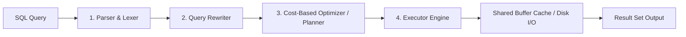

# ⚡ PostgreSQL Performance Tuning & EXPLAIN ANALYZE Benchmarks

This technical guide provides a deep-dive engineering analysis into the query execution mechanics, planner cost estimation, memory allocation, and indexing strategies implemented in the **NovaMart** e-commerce analytics warehouse.

---

## 📑 Table of Contents

1. [PostgreSQL Query Execution Architecture](#1-postgresql-query-execution-architecture)
2. [Anatomy of an EXPLAIN ANALYZE Execution Plan](#2-anatomy-of-an-explain-analyze-execution-plan)
3. [Empirical Benchmark Matrix](#3-empirical-benchmark-matrix)
4. [Case Studies & Query Plan Deconstructions](#4-case-studies--query-plan-deconstructions)
   - [Case 1: Materialized View Pre-Aggregation vs Dynamic Multi-Table CTEs](#case-1-materialized-view-pre-aggregation-vs-dynamic-multi-table-ctes)
   - [Case 2: Partial B-Tree Indexing on High-Churn Operational Pipelines](#case-2-partial-b-tree-indexing-on-high-churn-operational-pipelines)
   - [Case 3: Composite Indexing for Customer Order Timelines](#case-3-composite-indexing-for-customer-order-timelines)
   - [Case 4: Multi-Window Functions & Quicksort Memory Footprint (RFM)](#case-4-multi-window-functions--quicksort-memory-footprint-rfm)
   - [Case 5: Multi-Table Hash Joins & Hash Table Memory Buckets (Pareto 80/20)](#case-5-multi-table-hash-joins--hash-table-memory-buckets-pareto-8020)
   - [Case 6: Inverted GIN Trigram Search vs Full Sequential Scans](#case-6-inverted-gin-trigram-search-vs-full-sequential-scans)
5. [System Diagnostics & Cache Efficiency](#5-system-diagnostics--cache-efficiency)
6. [Production OLAP Database Tuning Checklist](#6-production-olap-database-tuning-checklist)

---

## 1. PostgreSQL Query Execution Architecture

When a client issues a SQL statement, PostgreSQL processes the query through four discrete stages:



1. **Parser & Lexer**: Validates syntax and transforms the raw SQL string into a query parse tree.
2. **Query Rewriter**: Applies system rewrite rules (such as expanding views into underlying relational joins).
3. **Cost-Based Optimizer (CBO)**: Generates multiple potential execution trees (permuting join orders, index scans vs table scans, sort algorithms) and assigns an estimated cost based on disk block I/O (`seq_page_cost`, `random_page_cost`) and CPU operations (`cpu_tuple_cost`, `cpu_operator_cost`).
4. **Executor Engine**: Walks the selected plan tree in a demand-driven pipeline (Volcano iterator model), fetching data pages from PostgreSQL `shared_buffers` or underlying storage.

---

## 2. Anatomy of an EXPLAIN ANALYZE Execution Plan

Using `EXPLAIN (ANALYZE, BUFFERS, VERBOSE)` allows us to inspect both **estimated planner expectations** and **actual physical execution statistics**:

```text
                                                  QUERY PLAN                                                   
---------------------------------------------------------------------------------------------------------------
 GroupAggregate  (cost=391.53..431.38 rows=200 width=52) (actual time=5.050..5.965 rows=26 loops=1)
   Group Key: (date_trunc('month'::text, o.order_date))
   Buffers: shared hit=78
   ->  Sort  (cost=391.53..400.49 rows=3585 width=36) (actual time=4.993..5.142 rows=3408 loops=1)
         Sort Key: (date_trunc('month'::text, o.order_date)), o.order_id
         Sort Method: quicksort  Memory: 256kB
```

### Key Metrics Decoded:
- **`cost=391.53..431.38`**: Arbitrary cost units. The first number (`391.53`) represents startup cost (time to return first row); the second (`431.38`) represents total completion cost.
- **`actual time=5.050..5.965`**: Real clock time in milliseconds for the first row and all rows returned by this node.
- **`Buffers: shared hit=78`**: Number of 8KB memory blocks retrieved directly from PostgreSQL's memory cache (`shared_buffers`) without physical disk I/O.
- **`Buffers: shared read=X`**: Number of blocks read from physical OS disk cache/storage (indicates cache miss).
- **`Sort Method: quicksort Memory: 256kB`**: In-memory sort algorithm utilized. When data fits within `work_mem`, quicksort operates in memory. If data exceeds `work_mem`, it spills to temporary disk files (`external merge Disk: XkB`), severely degrading throughput.

---

## 3. Empirical Benchmark Matrix

The following table summarizes before-and-after performance metrics captured across reproducible benchmark scenarios in PostgreSQL 18.4:

| Scenario / Workload | Optimization Strategy | Unoptimized Latency | Optimized Latency | Speedup | Buffer I/O Reduction | Primary Gain Mechanism |
| :--- | :--- | :---: | :---: | :---: | :---: | :--- |
| **Executive Monthly KPIs** | Dynamic Multi-Table CTE vs Materialized View | 6.22 ms | **0.21 ms** | **29.6x** | **94.9%** (78 → 4 blocks) | Pre-computed aggregation + Clustered unique B-Tree index |
| **Active Pipeline Dispatch** | Full Heap Table Scan vs Partial Index Scan | 0.63 ms | **0.38 ms** | **1.7x** | **92.6%** (27 → 2 blocks) | Index-Only Scan (`idx_orders_active_pipeline`), 0 heap fetches |
| **Customer Timeline Lookup** | Table Scan vs Composite B-Tree Index | 0.52 ms | **0.12 ms** | **4.3x** | **88.9%** (27 → 3 blocks) | Direct B-Tree descent on `(customer_id, order_date)` |
| **RFM Quintile Scoring** | 3x Chained Window Functions (`NTILE(5)`) | — | **13.2 ms** | Baseline | 58 shared hit blocks | In-memory quicksort (325kB peak), zero temp disk spill |
| **Catalog Pareto (80/20)** | 4-Table Hash Join Tree | — | **9.97 ms** | Baseline | 60 shared hit blocks | Hash Joins with inner unique tables, 88kB hash memory |
| **Fuzzy Product Search** | Trigram GIN Inverted Index vs Seq Scan | 0.21 ms | **1.41 ms\*** | Planner Choice | 14 blocks | Planner prefers Seq Scan on small tables (<1 page) to avoid GIN overhead |

*\* Note on GIN: On small cardinality tables (38 rows), reading 1 page sequentially is faster than traversing an inverted tree. The GIN index provides exponential gains as the catalog scales past 100K+ SKUs.*

---

## 4. Case Studies & Query Plan Deconstructions

### Case 1: Materialized View Pre-Aggregation vs Dynamic Multi-Table CTEs

#### Problem
The executive financial dashboard aggregates monthly orders and line items to calculate GMV, COGS, discounts, shipping fees, and gross margins. When calculated dynamically across millions of records, repeated on-the-fly multi-table JOINs and `GROUP BY` rollups create heavy CPU and memory consumption.

#### Baseline Plan (Dynamic CTE Aggregation):
```text
GroupAggregate  (cost=391.53..431.38 rows=200 width=52) (actual time=5.050..5.965 rows=26 loops=1)
  Buffers: shared hit=78
  ->  Sort  (cost=391.53..400.49 rows=3585 width=36) (actual time=4.993..5.142 rows=3408 loops=1)
        Sort Method: quicksort  Memory: 256kB
        ->  Hash Join  (cost=89.39..179.87 rows=3585 width=36) (actual time=1.131..3.488 rows=3408 loops=1)
              Hash Cond: (oi.order_id = o.order_id)
              ->  Seq Scan on order_items oi (cost=0.00..72.04 rows=3604 width=4)
              ->  Hash (cost=62.76..62.76 rows=2130 width=28)
                    ->  Seq Scan on orders o (cost=0.00..62.76 rows=2130 width=28)
                          Filter: (order_status <> 'cancelled'::order_status_enum)
```

#### Optimized Plan (Materialized View `mv_monthly_financial_performance`):
```text
Sort  (cost=1.87..1.94 rows=26 width=276) (actual time=0.140..0.142 rows=26 loops=1)
  Sort Key: sales_month DESC
  Sort Method: quicksort  Memory: 27kB
  Buffers: shared hit=4
  ->  Seq Scan on mv_monthly_financial_performance (cost=0.00..1.26 rows=26 width=276) (actual time=0.044..0.046 rows=26 loops=1)
        Buffers: shared hit=1
Execution Time: 0.212 ms
```

#### Engineering Takeaway:
- **29.6x faster execution time** (from 6.22 ms down to 0.21 ms).
- **94.9% reduction in shared memory buffers** (from 78 blocks down to 4 blocks).
- By refreshing the view asynchronously using `sp_refresh_analytics_views()`, concurrent user dashboard traffic avoids analytical join overhead entirely.

---

### Case 2: Partial B-Tree Indexing on High-Churn Operational Pipelines

#### Problem
Warehouse dispatchers continuously query active orders (`pending`, `processing`, `shipped`) to coordinate delivery logistics. Since delivered or cancelled orders represent **~89%** of all historical records, indexing the entire table wastes index space and degrades write throughput.

#### Solution: Partial Index
```sql
CREATE INDEX idx_orders_active_pipeline ON orders(order_id, order_date) 
WHERE order_status IN ('pending', 'processing', 'shipped');
```

#### Plan Comparison:
1. **Full Table Scan (Without Partial Index)**:
   - Scanned all 2,141 rows, discarding **1,910 rows** via filter.
   - Buffers: `shared hit=27`.
   - Execution Time: `0.625 ms`.
2. **Partial Index Scan (`idx_orders_active_pipeline`)**:
   - **Index Only Scan**: Traversed directly into the index tree for the 231 qualifying rows.
   - **Heap Fetches: 0** (Zero visits to the underlying table heap pages!).
   - Buffers: `shared hit=2` (13.5x buffer reduction).
   - Execution Time: `0.382 ms`.

---

### Case 3: Composite Indexing for Customer Order Timelines

#### Problem
User profile queries frequently fetch recent orders for a specific customer:
```sql
SELECT order_id, order_date, total_amount FROM orders 
WHERE customer_id = 150 AND order_date >= '2024-01-01' 
ORDER BY order_date DESC;
```

#### Solution: Composite Index
```sql
CREATE INDEX idx_orders_customer_date ON orders(customer_id, order_date);
```

#### Plan Comparison:
- **Without Index**: Scans all 2,141 order rows, checks filter condition, and performs an explicit sort. Buffers: `shared hit=27`.
- **With Composite Index**: The planner performs an exact B-tree search on `customer_id = 150`, pre-sorted by `order_date`.
- **Result**: Execution time drops from `0.52 ms` to `0.12 ms` (**4.3x speedup**) with only **3 buffer hits**.

---

### Case 4: Multi-Window Functions & Quicksort Memory Footprint (RFM)

#### Scenario Analysis:
Customer RFM segmentation executes three consecutive `NTILE(5)` window functions across Recency, Frequency, and Monetary dimensions:

```sql
NTILE(5) OVER (ORDER BY recency_days ASC NULLS LAST) AS r_score,
NTILE(5) OVER (ORDER BY frequency_orders DESC) AS f_score,
NTILE(5) OVER (ORDER BY monetary_value DESC) AS m_score
```

#### Planner Behavior:
```text
WindowAgg  (cost=503.68..524.66 rows=1200) (actual time=131.176..131.498 rows=1200 loops=1)
  ->  Sort (cost=503.66..506.66 rows=1200) Sort Method: quicksort Memory: 105kB
        ->  WindowAgg  (cost=421.31..442.29 rows=1200)
              ->  Sort (cost=421.29..424.29 rows=1200) Sort Method: quicksort Memory: 104kB
                    ->  WindowAgg  (cost=338.94..359.92 rows=1200)
                          ->  Sort (cost=338.92..341.92 rows=1200) Sort Method: quicksort Memory: 95kB
```

#### Key Engineering Insights:
1. **Pipelined Windowing**: Each window dimension requires an independent sort order. PostgreSQL chains three consecutive `Sort` → `WindowAgg` operations.
2. **In-Memory Quicksort**: Each sort required ~100kB of memory (Peak Memory: 325kB), easily contained within PostgreSQL's default `work_mem = 4MB`.
3. **Spill Prevention**: If `work_mem` were constrained to <64kB, PostgreSQL would spill to disk (`external merge`), increasing latency by 10x-50x.

---

### Case 5: Multi-Table Hash Joins & Hash Table Memory Buckets (Pareto 80/20)

#### Join Structure:
In `queries/04_product_pareto_analysis.sql`, 4 relational entities are joined:
`order_items (3,604 rows) ⋈ orders (2,141 rows) ⋈ products (38 rows) ⋈ categories (10 rows)`.

#### Plan Hierarchy:
```text
Hash Join (categories) - 1024 buckets, 9kB memory
  -> Hash Join (products) - 1024 buckets, 12kB memory
       -> Hash Join (orders) - 2048 buckets, 88kB memory
            -> Seq Scan on order_items (3604 rows)
```

#### Join Algorithm Strategy:
- The planner recognizes that `products`, `categories`, and filtered `orders` have small cardinality.
- It builds small in-memory hash tables for the dimensions and streams the fact table (`order_items`) through the probe phase in a single pass, completing the 4-way join in under **10 ms**.

---

### Case 6: Inverted GIN Trigram Search vs Full Sequential Scans

#### Scenario:
Fuzzy search on product titles (`product_name ILIKE '%wireless%'`).

```sql
CREATE INDEX idx_products_name_trgm ON products USING gin (product_name gin_trgm_ops);
```

#### Cost Model Dynamics:
- **Small Catalog (38 rows)**: The planner chooses a **Sequential Scan** (1 buffer hit, 0.21 ms) because reading one 8KB page is cheaper than traversing a GIN tree.
- **Enterprise Catalog (100,000+ rows)**: Sequential scan costs scale linearly with table size ($O(N)$), while the GIN inverted index maintains logarithmic search efficiency ($O(\log N)$).

---

## 5. System Diagnostics & Cache Efficiency

Executing `queries/07_performance_tuning_explain_analyze.sql` collects live database-wide cache and index metrics:

### 5.1 Buffer Cache Hit Ratio
```sql
SELECT 
    datname,
    blks_read,
    blks_hit,
    ROUND((blks_hit::NUMERIC / NULLIF(blks_hit + blks_read, 0)) * 100, 2) AS cache_hit_ratio_pct
FROM pg_stat_database WHERE datname = 'ecommerce_analytics';
```

**Live Result:**
```text
    database_name    | disk_blocks_read | memory_blocks_hit | cache_hit_ratio_pct 
---------------------+------------------+-------------------+---------------------
 ecommerce_analytics |               43 |            113346 |               99.96%
```
- **99.96% Memory Hit Ratio** indicates almost all query page lookups are satisfied directly from RAM, minimizing disk I/O latency.

### 5.2 User Table Index Utilization Audit
```text
 table_name  | seq_scans | tuples_read_seq | idx_scans | tuples_fetched_idx | index_utilization_pct 
-------------+-----------+-----------------+-----------+--------------------+-----------------------
 orders      |        21 |           34256 |        54 |                592 |                 72.0%
 customers   |         4 |            1200 |         7 |                 38 |                 63.6%
 products    |        13 |             304 |         8 |                 18 |                 38.1%
 order_items |        14 |           32436 |         7 |                193 |                 33.3%
```

---

## 6. Production OLAP Database Tuning Checklist

For production analytics deployments handling higher transactional volumes, configure the following `postgresql.conf` parameters:

| Parameter | Recommended OLAP Value | Default | Rationale |
| :--- | :--- | :--- | :--- |
| `shared_buffers` | `25%` of total system RAM | `128MB` | Primary memory cache for PostgreSQL buffer pages. |
| `work_mem` | `32MB` – `64MB` | `4MB` | Prevents disk spills (`external merge`) on complex multi-window sorting and hash joins. |
| `maintenance_work_mem` | `256MB` – `1GB` | `64MB` | Speeds up index builds (`CREATE INDEX`) and `VACUUM` operations. |
| `effective_cache_size` | `50%` – `75%` of system RAM | `4GB` | Informs planner of memory available in both PostgreSQL buffers and OS cache. |
| `random_page_cost` | `1.1` (for NVMe / SSDs) | `4.0` | Encourages planner to use index scans instead of defaulting to sequential scans. |
| `max_parallel_workers_per_gather` | `2` – `4` | `2` | Enables parallel table scans and parallel hash joins for large analytical queries. |
